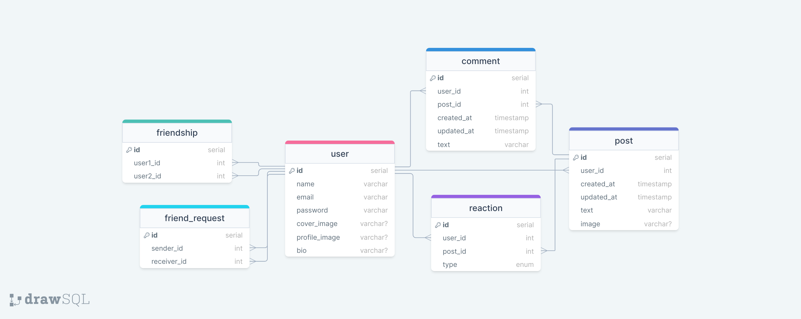

# 😊Emote😞
"😊Emote😞" is a social network site with a twist: you can only post/comment using exclusively emojis. So instead of saying 
'I love this photo' you could express it as '📸❤️😍.' Additionally, if you're stuck on which emojis to choose, you can 
use the built-in AI translator to convert your plaintext to emojis.

## Todo
- [x] Rough wireframes sketched on pen and paper
- [x] ER diagram 
- [x] Plan endpoints
- [ ] Build the backend with express.js, implementing endpoints one by one using the plan
- [ ] Build the frontend with react, implement pages one by one using the wireframes

## ER diagram

## Endpoint plan
#### Auth -
- POST /auth/login
- POST /auth/register
- POST /auth/logout

#### Users -
- GET /users?q=&page=&limit= (include friendship status)
- GET, PATCH /users/:id

#### Posts -
- GET /friendships/posts?page=&limit= (include reactions, a few comments)
- GET /users/:id/posts?page=&limit=
- POST /posts
- PATCH, DELETE /posts/:id

#### Reactions -
- POST, DELETE /posts/:id/reactions

#### Comments -
- GET /posts/:id/comments?page=&limit=
- POST /posts/:id/comments
- PATCH, DELETE /comments/:id

#### Friendships -
- GET /users/:id/friendships?q=&page=&limit=
- DELETE /friendships/:id
- POST /friendships/:userId (create friendship between logged in user and user of given id, delete friend request)

#### Friend requests -
- GET /friend-requests?q=&type=&page=&limit= (get friend requests for logged-in user)
- POST, DELETE /friend-requests/:userId

#### Others -
- GET /translate-text-to-emojis?text=
