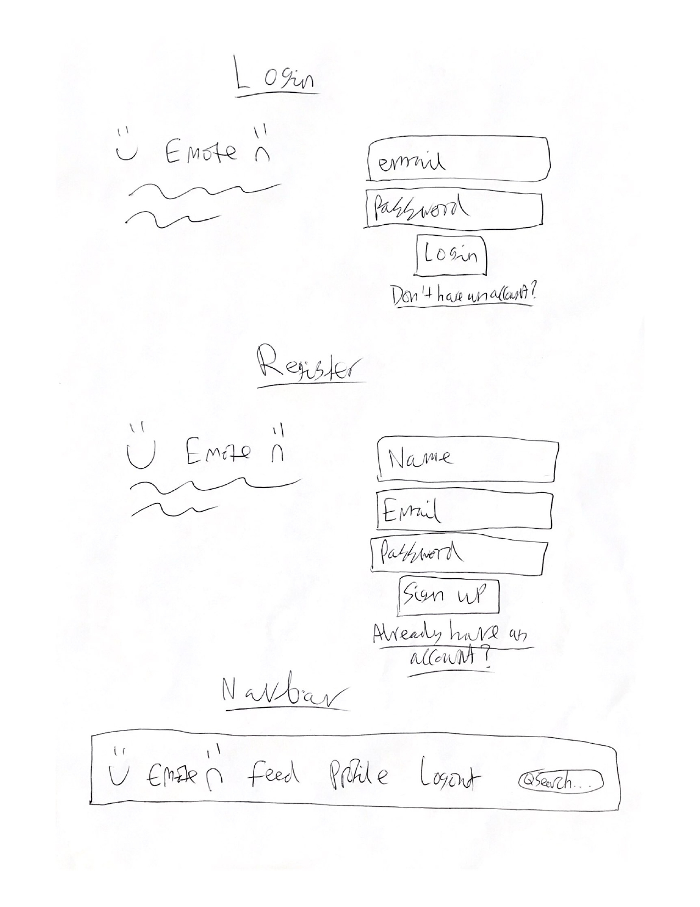
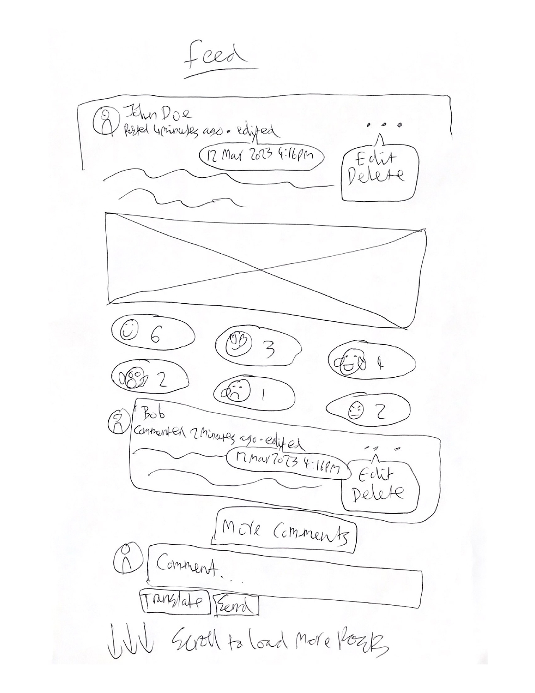
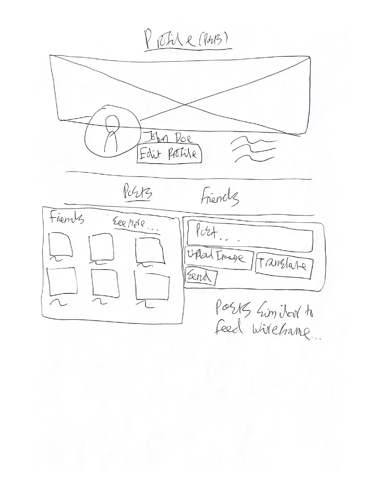
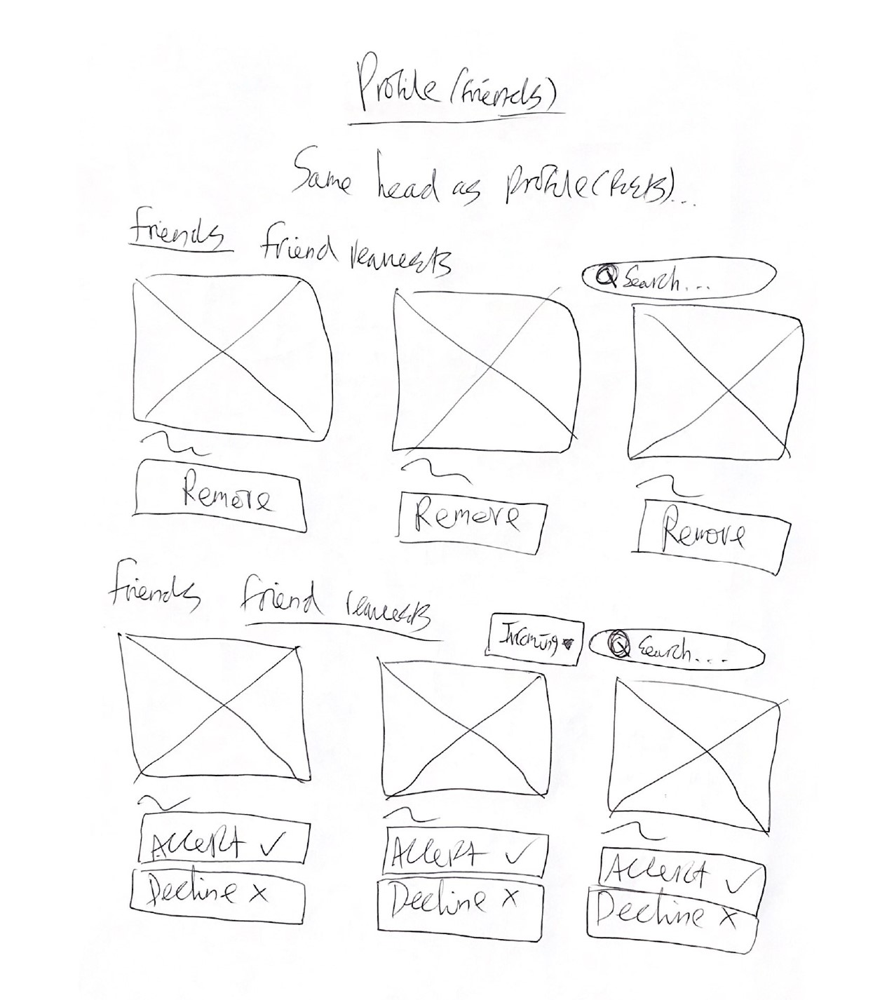
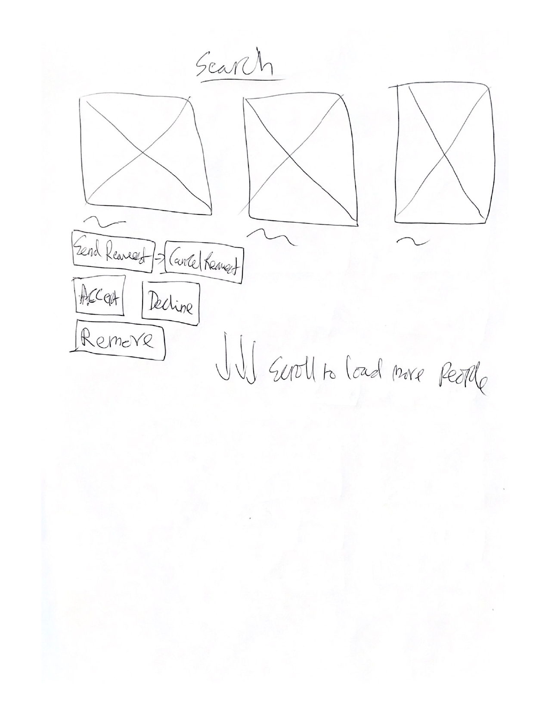

# 😊Emote😞

"😊Emote😞" is a social network site with a twist: you can only post/comment using exclusively emojis. So instead of saying
'I love this photo' you could express it as '📸❤️😍.' Additionally, if you're stuck on which emojis to choose, you can
use the built-in AI translator to convert your plaintext to emojis.

This is just the backend API built with Node, Express.js and PostgreSQL. 

If you're interested you can read a writeup I did about some of the key technical decisions I had to make whilst building
this project on my [blog](https://jacobcons.com/blog/technical-decisions-whilst-making-emote/).

## Features

- Personal user profile
- Feed of friends posts
- React to posts using various emojis
- Comment on posts
- Full friend request system
- Translate plaintext into pure emojis using chat-gpt with OpenAi API
- Account confirmation and password reset emails

## Api docs

[https://emote.jacobcons.com/api-docs](https://emote.jacobcons.com/api-docs)

## Todo

- [x] Rough wireframes sketched on pen and paper
- [x] Plan database layout
- [x] Plan endpoints
- [x] Build the backend with express.js, implementing endpoints one by one using the plan
  - Auth
    - [x] POST /auth/login
    - [x] POST /auth/register
  - Users
    - [x] GET /users?q=&page=&limit=
    - [x] GET, PATCH /users/:id
  - Posts
    - [x] GET /friendships/posts?page=&limit=&commentLimit= (include reactions, a few comments)
    - [x] GET /users/:id/posts?page=&limit=&commentLimit= (include reactions, a few comments)
    - [x] POST /posts
    - [x] PATCH, DELETE /posts/:id
  - Reactions
    - [x] POST, PATCH, DELETE /posts/:id/reactions
  - Comments
    - [x] GET /posts/:id/comments?page=&limit=
    - [x] POST /posts/:id/comments
    - [x] PATCH, DELETE /comments/:id
  - Friendships
    - [x] GET /users/:id/friendships?q=&page=&limit=
    - [x] POST /friendships/:userId (create friendship between logged in user and user of given id as long as they sent friend request, delete friend request)
    - [x] DELETE /friendships/:userId
  - Friend requests
    - [x] GET /friend-requests?q=&type=&page=&limit= (get friend requests for logged-in user)
    - [x] POST, DELETE /friend-requests/:userId
  - Misc
    - [x] POST /upload-image
    - [x] GET /translate-text-to-emojis?text=
- [x] Make swagger api docs
- [x] Deploy to digital ocean using docker and setup CI/CD

## Database layout

## Wireframes

