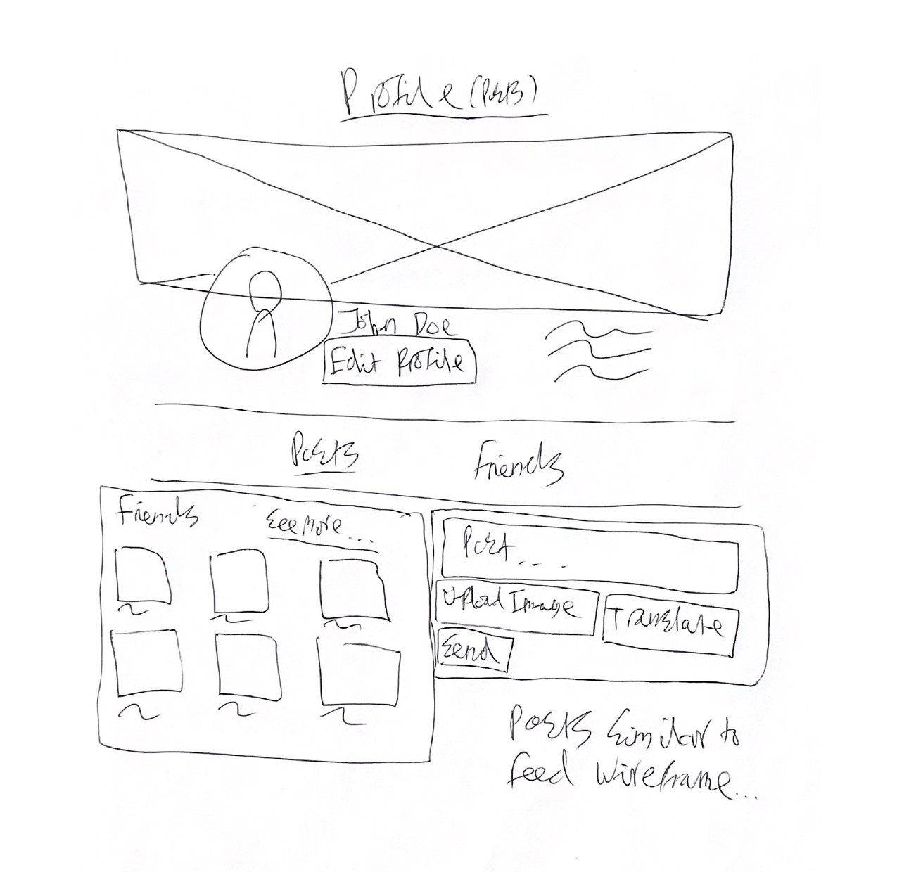
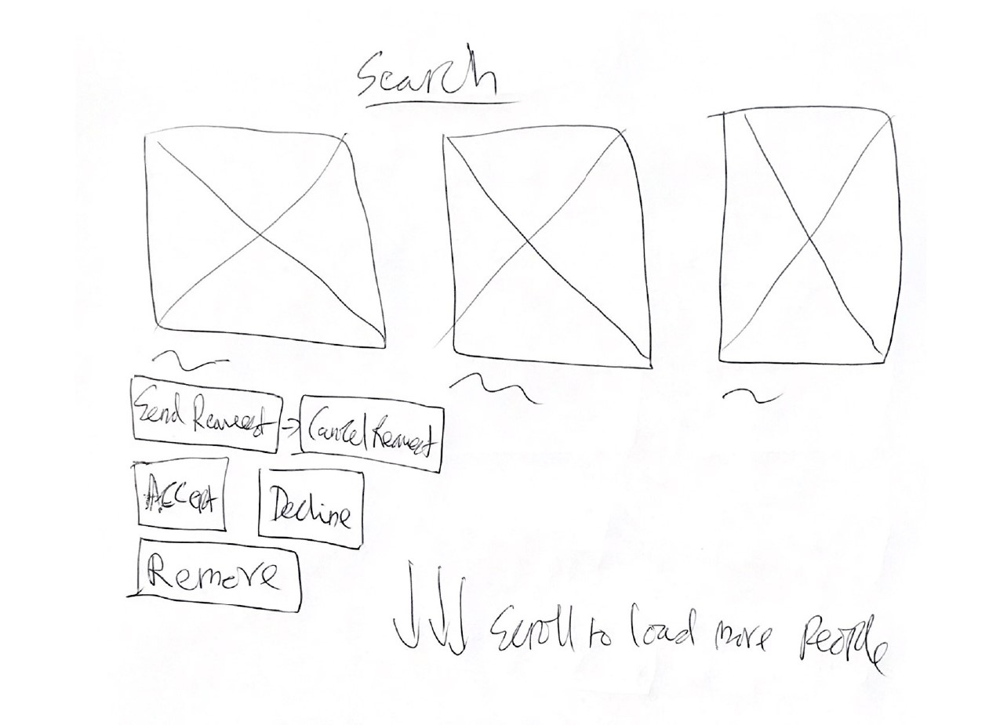

# 😊Emote😞
"😊Emote😞" is a social network site with a twist: you can only post/comment using exclusively emojis. So instead of saying
'I love this photo' you could express it as '📸❤️😍.' Additionally, if you're stuck on which emojis to choose, you can
use the built-in AI translator to convert your plaintext to emojis.

This is just the backend API built with Node, Express.js and PostgreSQL

## Features
- Feed of friends posts
- React to posts using various emojis
- Comment on posts
- Friend request system
- Translate plaintext into pure emojis using chat-gpt with OpenAi API 

## Api docs
Coming soon

## Todo
- [x] Rough wireframes sketched on pen and paper
- [x] ER diagram
- [x] Plan endpoints
- [x] Build the backend with express.js, implementing endpoints one by one using the plan
    - Auth
        - [x] POST /auth/login
        - [x] POST /auth/register
    - Users
        - [x] GET /users?q=&page=&limit=
        - [x] GET, PATCH /users/:id
    - Posts
        - [x] GET /friendships/posts?page=&limit=&commentLimit= (include reactions, a few comments)
        - [x] GET /users/:id/posts?page=&limit=&commentLimit= (include reactions, a few comments)
        - [x] POST /posts
        - [x] PATCH, DELETE /posts/:id
    - Reactions
        - [x] POST, PATCH, DELETE /posts/:id/reactions
    - Comments
        - [x] GET /posts/:id/comments?page=&limit=
        - [x] POST /posts/:id/comments
        - [x] PATCH, DELETE /comments/:id
    - Friendships
        - [x] GET /users/:id/friendships?q=&page=&limit=
        - [x] POST /friendships/:userId (create friendship between logged in user and user of given id as long as they sent friend request, delete friend request)
        - [x] DELETE /friendships/:userId
    - Friend requests
        - [x] GET /friend-requests?q=&type=&page=&limit= (get friend requests for logged-in user)
        - [x] POST, DELETE /friend-requests/:userId
    - Misc
        - [x] POST /upload-image
        - [x] GET /translate-text-to-emojis?text=
- [ ] Make api docs using swagger
- [ ] Deploy to digital ocean using docker

## Wireframes

## ER diagram

